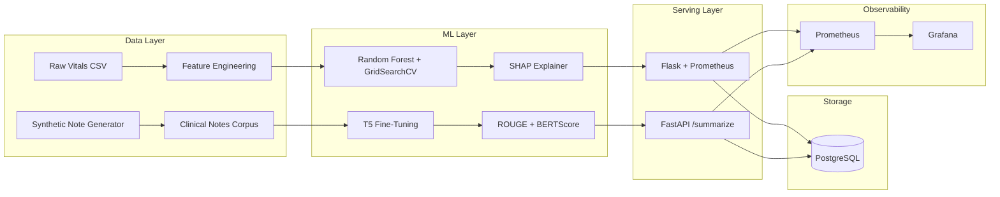

# HERA Architecture

## System Overview

HERA is a dual-pipeline healthcare AI platform designed to process structured vitals data and unstructured clinical text through independent ML subsystems that share a common data store and observability layer. The system prioritizes interpretability, auditability, and operational visibility — requirements driven by the healthcare domain where black-box predictions are insufficient.



## Design Tradeoffs

### Random Forest + SHAP over Deep Learning for Vitals

The vitals risk prediction task has 9 engineered features and a binary target. A Random Forest achieves strong classification performance on this feature set and — critically — supports SHAP's TreeExplainer, which computes exact Shapley values in polynomial time. Deep learning models (LSTM, transformer) would require approximation-based explanations (KernelSHAP or attention weights) that are slower and less faithful. In a clinical setting, the ability to say "SpO2 and MAP drove this High Risk classification" is more valuable than marginal accuracy gains from a neural approach.

### T5 for Clinical Note Summarization

Clinical notes require abstractive summarization — extractive methods fail because the salient information is distributed across sections (HPI, labs, imaging, assessment). T5's encoder-decoder architecture with the `summarize:` prefix paradigm provides a clean interface for conditional generation. T5-small was chosen over larger variants to enable fine-tuning on consumer hardware (CPU/single GPU) without quantization, keeping the training pipeline reproducible for any contributor.

### PostgreSQL over NoSQL

Patient predictions and clinical summaries have fixed, relational schemas. PostgreSQL provides ACID transactions, which matter for audit trails. The `patient_predictions` and `summaries` tables have predictable write patterns (append-only from inference endpoints), making relational storage more appropriate than document stores. If the system scaled to streaming ingestion, a write-ahead approach with batch inserts would be the first optimization before considering a different data store.

## Data Model

```
patient_predictions
├── id (SERIAL PK)
├── heart_rate, resp_rate, temperature, spo2 (FLOAT)
├── systolic_bp, diastolic_bp (FLOAT)
├── age (INT)
├── bmi, map (FLOAT)
├── predicted_label (VARCHAR) — "High Risk" | "Low Risk"
├── confidence (FLOAT)
└── predicted_at (TIMESTAMP)

summaries
├── id (SERIAL PK)
├── note (TEXT) — input clinical note
├── summary (TEXT) — model output
├── status (VARCHAR) — "SUCCESS" | "FAILURE"
└── timestamp (TIMESTAMP)
```

## Scalability Considerations

**10K patients:** The current architecture handles this without changes. Random Forest inference is O(n_trees * depth) per sample — microseconds per prediction. PostgreSQL handles 10K row inserts without connection pooling. T5 inference on CPU serves ~2-5 summaries/second.

**100K patients:** The primary bottleneck shifts to T5 inference latency. Mitigations: (1) add GPU-backed inference with batching, (2) introduce connection pooling (pgBouncer) for PostgreSQL, (3) horizontal scaling of FastAPI workers behind a load balancer, (4) async prediction logging to decouple inference from DB writes. The risk prediction pipeline scales linearly — Random Forest inference is embarrassingly parallel.

**1M+ patients:** Would require streaming ingestion (Kafka), model serving via dedicated infrastructure (TorchServe or Triton), and a data warehouse (BigQuery or Redshift) for historical analytics. The current monolithic API would be decomposed into microservices per subsystem.
