# HERA v4 Architecture

## System Overview

HERA v4 is a unified clinical AI + data engineering platform that processes patient encounters through a 9-stage pipeline. The system combines multi-agent clinical reasoning, ML inference, RAG-grounded knowledge retrieval, and a full data engineering layer — all orchestrated by a single Command Center endpoint.

```mermaid
flowchart TB
    subgraph Input Layer
        Vitals[Patient Vitals] --> API[FastAPI - 23 Endpoints]
        Notes[Clinical Notes] --> API
        FHIR_In[FHIR R4 Bundle] --> Conv[FHIR Converter] --> API
    end

    subgraph "Command Center (9-Stage Pipeline)"
        API --> CC[Command Center Orchestrator]

        CC --> S1[Stage 1: NER Extraction]
        CC --> S2[Stage 2: Knowledge Graph]
        CC --> S3[Stage 3: Multi-Agent Reasoning]
        CC --> S4[Stage 4: Risk Prediction]
        CC --> S5[Stage 5: RAG Retrieval]
        CC --> S6[Stage 6: Clinical Summarization]
        CC --> S7[Stage 7: Safety Evaluation]
        CC --> S8[Stage 8: FHIR R4 Export]
        CC --> S9[Stage 9: Data Engineering]
    end

    subgraph "AI Subsystems"
        S1 --> NER[Regex + SciSpaCy NER]
        S2 --> KG[NetworkX Knowledge Graph]
        S3 --> Triage[Triage Agent - ESI v4]
        S3 --> Diag[Diagnostic Agent - ICD-10]
        S3 --> Treat[Treatment Agent]
        S4 --> RF[Random Forest + SHAP]
        S5 --> RAG[FAISS + Sentence-Transformers]
        S6 --> T5[T5 Transformer]
        S7 --> Judge[LLM-as-Judge - 4 Axis]
        S8 --> FHIR_Out[FHIR R4 Bundle Output]
    end

    subgraph "Data Engineering Layer (Stage 9)"
        S9 --> Stream[Event Streaming<br/>Schema Registry + DLQ]
        S9 --> DQ[Data Quality<br/>12 Checks, 5 Categories]
        S9 --> Lin[Column Lineage<br/>36 Nodes, 38 Edges]
        S9 --> WH[Star Schema Warehouse<br/>Fact + 4 Dimensions]
        S9 --> CDC[Change Data Capture<br/>Field Diffs + SHA-256]
        S9 --> Cat[Data Catalog<br/>12 Datasets + PII Report]
        S9 --> ETL[ETL Orchestrator<br/>16-Task DAG]
    end

    subgraph Infrastructure
        PG[(PostgreSQL<br/>Audit Trail)]
        PROM[Prometheus + Grafana]
        DOCK[Docker Compose]
    end

    CC --> PG
    API --> PROM
```



## Pipeline Stages

### Stage 1: NER Extraction (`ner/extractor.py`)
Extracts biomedical entities from clinical notes using regex pattern matching (with optional SciSpaCy). Detects medications, conditions, procedures, lab values, and vital signs. Entities are linked to UMLS-style categories for downstream processing.

### Stage 2: Knowledge Graph (`ner/knowledge_graph.py`)
Builds a NetworkX patient graph from extracted entities. Nodes represent entities (medications, conditions); edges represent relationships (treats, indicates, contraindicated_with). Supports graph traversal queries for clinical decision support.

### Stage 3: Multi-Agent Reasoning (`agents/`)
Three specialized agents process sequentially:
- **Triage Agent** — ESI v4 algorithm classifies acuity (1–5) using vitals + chief complaint
- **Diagnostic Agent** — Generates ranked differential diagnoses with ICD-10 codes
- **Treatment Agent** — Plans evidence-based interventions with contraindication checking

Inter-agent communication uses typed protocols (`AgentMessage` dataclass) with full audit trail.

### Stage 4: Risk Prediction (`risk_prediction/`)
Random Forest classifier with 9 engineered features (including derived BMI and MAP). SHAP TreeExplainer provides feature-level explanations. Outputs binary risk classification with confidence score.

### Stage 5: RAG Retrieval (`rag/`)
FAISS vector search over curated medical guidelines (AHA, IDSA, ESC). Sentence-transformers encode queries; top-k passages are retrieved with similarity scores and citation metadata.

### Stage 6: Clinical Summarization (`clinical_summarizer/`)
T5-small encoder-decoder generates abstractive clinical note summaries. RAG context augments the input for grounded generation. Outputs summary text with compression ratio.

### Stage 7: Safety Evaluation (`evaluation/evaluator.py`)
LLM-as-Judge evaluates outputs on 4 axes:
- **Factual consistency** — entity overlap between source and output
- **Hallucination detection** — entities in output not grounded in source
- **Medical accuracy** — clinical terminology and coding correctness
- **Clinical safety** — checks for dangerous omissions or contradictions

### Stage 8: FHIR Export (`fhir_layer/converter.py`)
Converts the full pipeline output into an HL7 FHIR R4 Bundle containing Patient, Observation, RiskAssessment, and DocumentReference resources. Supports bidirectional FHIR ↔ internal format conversion.

### Stage 9: Data Engineering (`data_engineering/`)
Seven integrated systems process the pipeline output:

1. **Event Streaming** (`streaming.py`) — Kafka-style ingestion with schema registry (3 versions of `patient_vitals`), partitioned topics, dead letter queue, and consumer groups
2. **Data Quality** (`quality.py`) — 12 validation checks across 5 categories (schema, completeness, accuracy, consistency, freshness) with clinical range validation
3. **Column Lineage** (`lineage.py`) — DAG tracking field-level transformations across all 8 preceding stages (36 nodes, 38 edges, PII flagging)
4. **Star Schema Warehouse** (`warehouse.py`) — SQLite with `fact_clinical_encounters` + 4 dimensions (`dim_patient`, `dim_diagnosis`, `dim_provider`, `dim_time`) + hourly aggregation
5. **Change Data Capture** (`cdc.py`) — Before/after snapshots with field-level diffs, SHA-256 checksums, named consumers, and event replay from any sequence number
6. **Data Catalog** (`catalog.py`) — 12 datasets registered with PII report, freshness SLAs, and searchable API
7. **ETL Orchestrator** (`orchestrator.py`) — Airflow-style 16-task DAG with topological sort, retry logic (configurable per task), SLA monitoring, and upstream failure propagation

## Data Models

### Star Schema (Analytics Warehouse)

```
fact_clinical_encounters
├── encounter_id (PK)
├── patient_key (FK → dim_patient)
├── diagnosis_key (FK → dim_diagnosis)
├── provider_key (FK → dim_provider)
├── time_key (FK → dim_time)
├── esi_level, risk_score, confidence
├── quality_score, lineage_nodes, lineage_edges
├── processing_time_ms
└── created_at

dim_patient
├── patient_key (PK), patient_id, age, gender

dim_diagnosis
├── diagnosis_key (PK), icd10_code, description, category

dim_provider
├── provider_key (PK), provider_name, provider_type, department
│   (seeded with 9 HERA agents: triage, diagnostic, treatment, etc.)

dim_time
├── time_key (PK), full_date, year, quarter, month, day, hour, day_of_week

agg_hourly_summary
├── hour, encounter_count, avg_risk_score, avg_quality_score, avg_processing_ms
```

### Column-Level Lineage DAG

```
raw_input.clinical_note ──[regex_extraction]──→ ner_output.medications
raw_input.clinical_note ──[regex_extraction]──→ ner_output.conditions
ner_output.medications ──[graph_construction]──→ knowledge_graph.nodes
raw_input.heart_rate ──[triage_classification]──→ reasoning_output.esi_level
raw_input.systolic_bp ──[derived: dbp+(sbp-dbp)/3]──→ derived_features.mean_arterial_pressure
derived_features.map ──[ml_inference]──→ risk_output.risk_score
raw_input.clinical_note ──[vector_search]──→ rag_output.retrieved_passages
summary_output.summary_text ──[llm_judge]──→ eval_output.factual_consistency
risk_output.risk_score ──[fhir_mapping]──→ fhir_output.RiskAssessment
```

### ETL Pipeline DAG (16 Tasks)

```
ingest_data → validate_quality → extract_entities → build_knowledge_graph
                               → run_triage ─────→ run_diagnosis → run_treatment
                               → predict_risk
                                                    run_diagnosis → retrieve_rag_context → generate_summary → evaluate_safety
                                                                                                                              ↓
export_fhir ← [run_treatment, predict_risk, generate_summary, evaluate_safety]
    ├── load_warehouse → emit_cdc_events
    │                  → update_catalog
    └── track_lineage → update_catalog
```

## Design Tradeoffs

### Unified Command Center over Microservices
A single `POST /api/command-center` endpoint runs all 9 stages per patient. This simplifies deployment and ensures atomic processing. The tradeoff: no independent scaling per stage. At current scale (single-server), this is the right call. Decomposition into microservices would happen at 100K+ patients/day.

### SQLite for Warehouse over PostgreSQL
The analytics warehouse uses SQLite for zero-dependency local operation. The star schema design is identical to what you'd deploy on PostgreSQL or Redshift — switching backends requires changing only the connection string, not the schema or queries.

### Custom DE Systems over Airflow/Kafka/dbt
Each DE system is a focused Python module (~200-400 lines) that demonstrates the concept without external dependencies. This makes the entire platform runnable with `pip install -r requirements.txt` — no Kafka cluster, no Airflow scheduler, no dbt project needed. The patterns (schema registry, DAG execution, CDC capture) are production-faithful.

### Random Forest + SHAP over Deep Learning for Vitals
9 engineered features with binary target. Random Forest + SHAP's TreeExplainer gives exact Shapley values in polynomial time. Deep learning would need approximation-based explanations. In clinical risk scoring, "SpO2 and MAP drove this High Risk" is more valuable than marginal accuracy gains.

### T5-small over Larger Variants
Enables fine-tuning on consumer hardware (CPU/single GPU) without quantization. Training pipeline stays reproducible for any contributor.

### Column-Level Lineage over Table-Level
Field-level provenance enables precise impact analysis ("if systolic_bp changes, what outputs are affected?") and PII tracking for HIPAA compliance. Table-level lineage is too coarse for healthcare governance.

## Scalability Path

**Current (single server):** 23 endpoints, 104 tests, all systems in-process. Handles thousands of encounters/day.

**10K encounters/day:** Add connection pooling (pgBouncer), async prediction logging, multi-worker uvicorn.

**100K encounters/day:** Swap SQLite warehouse for PostgreSQL/Redshift. Add GPU inference for T5. Horizontal FastAPI scaling behind load balancer.

**1M+ encounters/day:** Decompose into microservices. Swap custom streaming for Kafka. Swap custom orchestrator for Airflow. Add Triton/TorchServe for model serving. Data warehouse moves to BigQuery/Snowflake.

## Service Health (17 Systems)

The `/api/health` endpoint reports on all 17 services:
1. multi_agent_reasoning
2. rag_knowledge_base
3. clinical_ner
4. knowledge_graph
5. fhir_converter
6. clinical_evaluator
7. risk_predictor
8. clinical_summarizer
9. command_center
10. event_streaming
11. data_lineage
12. data_quality
13. analytics_warehouse
14. etl_orchestrator
15. cdc_stream
16. data_catalog
17. prometheus_metrics
