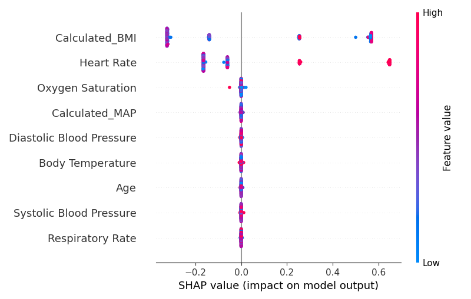

# hera-healthcare-ai
# 🏥 HERA+ Healthcare AI Platform

> A full-stack, real-time healthcare AI system designed to monitor patient vitals, predict health risks (e.g., sepsis), and offer explainable AI insights. Built from scratch with a learning-first approach.

---

## 📅 Weekly Progress Overview

### ✅ Week 1: Foundations & First Model

| Day | Topic | Highlights |
|-----|-------|------------|
| 1   | Project Setup | Python, GitHub repo, README, and basic environment |
| 2   | Load Data & Visualize | Loaded human vitals dataset, time-series plots |
| 3   | Clean Data & Engineering | Filled missing values, added noise, calculated BMI/MAP |
| 4   | EDA | Histograms, boxplots, scatterplots, correlation matrix |
| 5   | First ML Model | Trained RandomForestClassifier to predict Risk Category |
| 6   | Hyperparameter Tuning | Used GridSearchCV for better model performance |
| 7   | SHAP Explainability | Global feature importance via SHAP (wrapped RF model) |

---

## 📈 Example SHAP Plot

---

## 🧠 Learning Highlights

- Learned to handle real-world healthcare data (missing values, noise)
- Built and tuned a RandomForest model
- Visualized clinical feature impacts using SHAP
- Practiced clean GitHub workflows (daily commits, markdown logs)

---

## 🗂️ Project Structure

hera-healthcare-ai/ ├── week1_day1/ # Setup notes ├── week1_day2/ # Data loading & visualization ├── week1_day3/ # Cleaning & feature engineering ├── week1_day4/ # EDA & visual insights ├── week1_day5/ # First ML model ├── week2_day6/ # GridSearchCV tuning ├── week2_day7/ # SHAP explainability

---

## ⌛ Updated on: April 21, 2025

