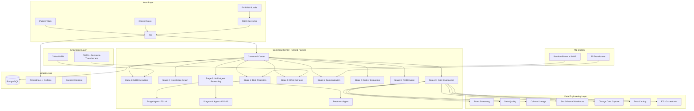

# HERA v4 — Healthcare Reasoning & Analytics Platform

**Multi-agent clinical AI + full data engineering pipeline with event streaming, column-level lineage, data quality, star schema warehouse, ETL orchestration, CDC, and data catalog.**

[](https://github.com/Nerdboss-stm/hera-healthcare-ai/actions)


---

## What This Is

HERA is a production-grade healthcare AI platform with two integrated layers:

1. **AI Layer** — A multi-agent clinical reasoning pipeline (Triage → Diagnostic → Treatment) backed by RAG knowledge retrieval, biomedical NER, FHIR R4 interoperability, risk prediction, clinical summarization, and LLM-as-Judge safety evaluation.

2. **Data Engineering Layer** — Seven production-grade DE systems (event streaming, column-level lineage, data quality, star schema warehouse, ETL orchestrator, CDC, data catalog) that process every patient case end-to-end.

Both layers are unified through a **Command Center** that runs all 9 stages as a single pipeline per patient encounter.

### What Makes This Different

| Capability | What It Does | Why It Matters |
|---|---|---|
| **Multi-Agent Reasoning** | 3 specialized agents (Triage → Diagnostic → Treatment) with auditable reasoning chains | Agents decompose clinical problems like real teams — separation of concerns + auditability |
| **RAG Knowledge Base** | FAISS vector store over medical guidelines (AHA, IDSA, ESC) with citation tracking | Grounds outputs in evidence-based medicine, not just model weights |
| **Clinical NER + Knowledge Graph** | Regex + SciSpaCy entity extraction → NetworkX patient graph | Structures unstructured notes into queryable, traversable relationships |
| **FHIR R4 Interoperability** | Bidirectional FHIR Bundle ↔ internal format conversion | Industry-standard healthcare data exchange (21st Century Cures Act) |
| **LLM-as-Judge Evaluation** | Factual consistency, hallucination detection, clinical safety scoring | Catches clinically dangerous errors that n-gram metrics miss |
| **Event Streaming** | Kafka-style pipeline with schema registry (3 versions), partitioning, DLQ | Production ingestion with schema evolution and exactly-once semantics |
| **Column-Level Lineage** | DAG tracking every field transformation across 8 pipeline stages (36+ nodes, 38+ edges) | Full provenance — know exactly how every output was derived |
| **Data Quality** | Great Expectations-style framework with 12 checks across 5 categories | Clinical range validation, SSN detection, BP consistency checks |
| **Star Schema Warehouse** | Fact + 4 dimension tables with hourly aggregation | Analytics-ready data model for clinical encounter analysis |
| **ETL Orchestrator** | Airflow-style 16-task DAG with topological sort, retry logic, SLA monitoring | Production pipeline execution with dependency resolution |
| **Change Data Capture** | Before/after snapshots, field-level diff, SHA-256 checksums, event replay | Complete audit trail for every data mutation |
| **Data Catalog** | 12 datasets with PII report, freshness SLAs, searchable API | Data governance and discoverability across the platform |

---

## Architecture


```mermaid
flowchart TB
    subgraph Input Layer
        A[Patient Vitals] --> API
        B[Clinical Notes] --> API
        C[FHIR R4 Bundle] --> FHIR[FHIR Converter]
        FHIR --> API
    end

    subgraph Command Center - Unified Pipeline
        API --> CC[Command Center]
        CC --> S1[Stage 1: NER Extraction]
        CC --> S2[Stage 2: Knowledge Graph]
        CC --> S3[Stage 3: Multi-Agent Reasoning]
        S3 --> Triage[Triage Agent - ESI v4]
        S3 --> Diag[Diagnostic Agent - ICD-10]
        S3 --> Treat[Treatment Agent]
        CC --> S4[Stage 4: Risk Prediction]
        CC --> S5[Stage 5: RAG Retrieval]
        CC --> S6[Stage 6: Summarization]
        CC --> S7[Stage 7: Safety Evaluation]
        CC --> S8[Stage 8: FHIR Export]
        CC --> S9[Stage 9: Data Engineering]
    end

    subgraph Knowledge Layer
        RAG[FAISS + Sentence-Transformers] --> S5
        NER[Clinical NER] --> S1
    end

    subgraph ML Models
        RF[Random Forest + SHAP] --> S4
        T5[T5 Transformer] --> S6
    end

    subgraph Data Engineering Layer
        S9 --> Stream[Event Streaming]
        S9 --> DQ[Data Quality]
        S9 --> Lin[Column Lineage]
        S9 --> WH[Star Schema Warehouse]
        S9 --> CDC[Change Data Capture]
        S9 --> Cat[Data Catalog]
        S9 --> ETL[ETL Orchestrator]
    end

    subgraph Infrastructure
        DB[(PostgreSQL)]
        Prom[Prometheus + Grafana]
        Docker[Docker Compose]
    end

    CC --> DB
    API --> Prom
```

---

## API Endpoints (23)

### Clinical AI Endpoints

| Endpoint | Method | Description |
|----------|--------|-------------|
| `/api/command-center` | POST | Full 9-stage unified pipeline (AI + DE) per patient |
| `/api/reason` | POST | Multi-agent clinical reasoning (Triage → Diagnosis → Treatment) |
| `/api/rag/query` | POST | Semantic search over medical knowledge base |
| `/api/rag/summarize` | POST | RAG-augmented clinical note summarization with citations |
| `/api/ner/extract` | POST | Extract medications, conditions, procedures, lab values |
| `/api/ner/graph` | POST | Build patient knowledge graph from clinical note |
| `/api/fhir/predict` | POST | Accept FHIR R4 Bundle → return FHIR RiskAssessment |
| `/api/evaluate` | POST | LLM-as-Judge safety evaluation (4-axis) |
| `/api/predict` | POST | Patient risk prediction from vitals |
| `/api/summarize` | POST | Clinical note summarization |
| `/api/summarize/upload` | POST | Summarize from file upload |
| `/api/health` | GET | Service health check (17 subsystems) |
| `/api/usage` | GET | API usage statistics |
| `/metrics` | GET | Prometheus metrics |

### Data Engineering Endpoints

| Endpoint | Method | Description |
|----------|--------|-------------|
| `/api/de/stream` | POST | Ingest patient data via event streaming with schema validation |
| `/api/de/lineage` | GET | Column-level data lineage DAG (36 nodes, 38 edges) |
| `/api/de/quality` | POST | Data quality validation (12 checks, 5 categories) |
| `/api/de/warehouse` | GET | Star schema analytics warehouse stats |
| `/api/de/orchestrator` | GET | ETL pipeline DAG definition (16 tasks) |
| `/api/de/cdc` | GET | CDC event log with replay support |
| `/api/de/catalog` | GET | Data catalog (12 datasets, PII report) |
| `/api/de/dashboard` | GET | All 7 DE systems in one response |

---

## Quick Start

```bash
# Clone and install
git clone https://github.com/Nerdboss-stm/hera-healthcare-ai.git
cd hera-healthcare-ai
pip install -r requirements.txt

# Run the API
uvicorn serving.api:app --host 0.0.0.0 --port 8000

# Or use Docker Compose (includes PostgreSQL, Prometheus, Grafana)
docker-compose up --build -d
```

### Try the Command Center (Full Pipeline)

```bash
curl -X POST http://localhost:8000/api/command-center \
  -H "Content-Type: application/json" \
  -d '{
    "patient_id": "pt-001",
    "chief_complaint": "chest pain",
    "clinical_note": "65yo male with acute chest pain radiating to left arm, diaphoresis, tachycardia. History of hypertension and diabetes. Currently on aspirin and metoprolol.",
    "heart_rate": 110,
    "respiratory_rate": 22,
    "body_temperature": 37.2,
    "oxygen_saturation": 93,
    "systolic_bp": 90,
    "diastolic_bp": 60,
    "age": 65,
    "gender": "male",
    "medical_history": ["hypertension", "diabetes"],
    "current_medications": ["aspirin", "metoprolol"],
    "allergies": ["penicillin"]
  }'
```

**Response includes all 9 stages:**
1. NER extraction (medications, conditions, procedures, lab values)
2. Patient knowledge graph
3. Multi-agent reasoning (ESI triage + differential diagnosis + treatment plan)
4. Risk prediction with confidence score
5. RAG-retrieved medical guidelines with citations
6. Clinical note summarization
7. Safety evaluation (factual consistency, hallucination, clinical safety)
8. FHIR R4 Bundle export
9. Data engineering (streaming, quality, lineage, warehouse, CDC, catalog)

### Try Data Engineering Endpoints

```bash
# Get full DE dashboard
curl http://localhost:8000/api/de/dashboard

# View column-level lineage
curl http://localhost:8000/api/de/lineage

# View ETL DAG definition
curl http://localhost:8000/api/de/orchestrator

# View data catalog
curl http://localhost:8000/api/de/catalog

# Run data quality checks
curl -X POST http://localhost:8000/api/de/quality \
  -H "Content-Type: application/json" \
  -d '{"heart_rate": 110, "respiratory_rate": 22, "body_temperature": 37.2, "oxygen_saturation": 93, "systolic_bp": 90, "diastolic_bp": 60, "age": 65}'
```

---

## Project Structure

```
hera-healthcare-ai/
├── agents/                          # Multi-Agent Clinical Reasoning
│   ├── protocols.py                 # Typed inter-agent message contracts
│   ├── triage.py                    # ESI v4 triage algorithm
│   ├── diagnostic.py                # Differential diagnosis with ICD-10
│   ├── treatment.py                 # Evidence-based treatment protocols
│   └── orchestrator.py              # Pipeline coordinator + audit trail
├── rag/                             # RAG Medical Knowledge Base
│   ├── knowledge_base.py            # Curated medical corpus (AHA/IDSA/ESC)
│   ├── retriever.py                 # FAISS vector search + sentence-transformers
│   └── rag_pipeline.py              # Retrieve → augment → generate
├── ner/                             # Clinical NER + Knowledge Graph
│   ├── extractor.py                 # Biomedical entity extraction (UMLS-linked)
│   └── knowledge_graph.py           # NetworkX patient graph with relationships
├── fhir_layer/                      # FHIR R4 Interoperability
│   └── converter.py                 # Bidirectional FHIR ↔ internal conversion
├── evaluation/                      # LLM-as-Judge Framework
│   └── evaluator.py                 # Factual consistency, hallucination, safety
├── risk_prediction/                 # ML Risk Classification
│   ├── preprocessing.py             # Feature engineering (BMI, MAP)
│   ├── train.py                     # Random Forest training
│   ├── tune.py                      # GridSearchCV hyperparameter tuning
│   └── explain.py                   # SHAP explainability
├── clinical_summarizer/             # T5 Clinical Summarization
│   ├── fine_tune.py                 # End-to-end T5 fine-tuning
│   ├── evaluate.py                  # ROUGE + BERTScore evaluation
│   └── generate_notes.py            # Synthetic clinical note generator
├── data_engineering/                # Data Engineering Pipeline (7 systems)
│   ├── streaming.py                 # Kafka-style event streaming + schema registry
│   ├── lineage.py                   # Column-level data lineage DAG
│   ├── quality.py                   # Great Expectations-style data quality
│   ├── warehouse.py                 # Star schema analytics warehouse (SQLite)
│   ├── orchestrator.py              # Airflow-style ETL DAG (16 tasks)
│   ├── cdc.py                       # Change data capture with event replay
│   └── catalog.py                   # Data catalog with PII + freshness tracking
├── serving/                         # FastAPI Application
│   ├── api.py                       # 23 REST endpoints
│   ├── command_center.py            # 9-stage unified pipeline orchestrator
│   ├── schemas.py                   # Pydantic request/response models
│   ├── middleware.py                # Auth, rate limiting, CORS
│   ├── summarizer.py                # T5 inference wrapper
│   ├── risk_predictor.py            # Risk model inference
│   ├── db_logger.py                 # PostgreSQL logging
│   ├── metrics.py                   # Prometheus counters/histograms
│   └── static/index.html            # Interactive web dashboard
├── tests/                           # 104 tests across 8 test files
│   ├── test_agents.py               # 20 tests: triage, diagnostic, treatment, orchestrator
│   ├── test_ner.py                  # 13 tests: NER extraction, knowledge graph
│   ├── test_fhir.py                 # 8 tests: FHIR parsing, conversion
│   ├── test_evaluation.py           # 8 tests: factual consistency, hallucination
│   ├── test_data_engineering.py     # 41 tests: all 7 DE systems + API endpoints
│   ├── test_api.py                  # 4 tests: API endpoint smoke tests
│   ├── test_risk_prediction.py      # 5 tests: risk model pipeline
│   └── test_summarizer.py           # 5 tests: summarization pipeline
├── database/schema.sql              # PostgreSQL schema (6 tables)
├── config/                          # Configuration
│   ├── prometheus.yml               # Prometheus scrape config
│   ├── alerts.yml                   # Alert rules
│   └── settings.py                  # App settings
├── .github/workflows/ci.yml         # CI/CD: lint → test → model smoke → Docker
├── docker-compose.yml               # Full-stack orchestration
├── Dockerfile                       # API container
└── requirements.txt                 # Python dependencies
```

---

## Tech Stack

| Layer | Technology | Purpose |
|-------|-----------|---------|
| **Multi-Agent** | Custom Python agents | Clinical reasoning pipeline (Triage → Dx → Tx) |
| **RAG** | FAISS + sentence-transformers | Evidence-grounded retrieval from medical guidelines |
| **NER** | Regex + SciSpaCy (optional) | Biomedical entity extraction (meds, conditions, procedures) |
| **Knowledge Graph** | NetworkX | Patient relationship graph |
| **Interoperability** | HL7 FHIR R4 | Healthcare data exchange standard |
| **Risk Model** | scikit-learn (Random Forest) + SHAP | Interpretable risk classification |
| **Summarization** | HuggingFace T5 | Abstractive clinical summarization |
| **Evaluation** | Custom NLI-based evaluator | Factual consistency + safety scoring |
| **Event Streaming** | Custom Kafka-style engine | Schema-validated ingestion with DLQ |
| **Data Lineage** | Custom DAG tracker | Column-level transformation provenance |
| **Data Quality** | Custom Great Expectations-style | 12 validation checks, 5 categories |
| **Warehouse** | SQLite star schema | Fact + dimension analytics tables |
| **ETL Orchestrator** | Custom Airflow-style DAG | 16-task pipeline with retry + SLA |
| **CDC** | Custom change capture engine | Field-level diffs with SHA-256 checksums |
| **Data Catalog** | Custom catalog service | 12 datasets, PII tracking, freshness SLAs |
| **API** | FastAPI + Pydantic | 23 REST endpoints with validation |
| **Database** | PostgreSQL | Audit trail + prediction logging |
| **Monitoring** | Prometheus + Grafana | Observability |
| **CI/CD** | GitHub Actions + ruff | Lint, test, model smoke test, Docker |
| **Container** | Docker + Docker Compose | Full-stack orchestration |

---

## Key Engineering Decisions

| Decision | Rationale |
|----------|-----------|
| **Multi-agent over monolithic LLM** | Clinical reasoning is multi-step — triage, diagnosis, and treatment require different expertise. Agents provide separation of concerns, auditability, and independent testability. |
| **RAG over fine-tuning for medical knowledge** | Medical guidelines update frequently. RAG lets us swap knowledge without retraining. Citation tracking provides provenance that fine-tuning cannot. |
| **FHIR R4 for interoperability** | FHIR is mandated for US healthcare data exchange (21st Century Cures Act). Native FHIR support demonstrates domain expertise. |
| **LLM-as-Judge over ROUGE alone** | ROUGE measures n-gram overlap but can't detect hallucinations or clinically dangerous errors. Entity-level precision/recall and safety checks catch what ROUGE misses. |
| **Random Forest + SHAP over deep learning** | Interpretability is non-negotiable in clinical risk scoring. SHAP provides feature-level explanations that clinicians can audit. |
| **Unified Command Center** | Every patient case runs through all 9 stages as a single pipeline invocation. No manual orchestration — one POST gives you the full clinical + DE output. |
| **Column-level lineage** | Field-level provenance tracking enables impact analysis and HIPAA compliance. If a source column changes, you know exactly what breaks downstream. |
| **Star schema over flat tables** | Dimension modeling enables fast analytical queries across patients, diagnoses, providers, and time without expensive joins on raw data. |
| **Schema registry for streaming** | Schema evolution with versioning prevents breaking changes. Dead letter queue captures malformed events without blocking the pipeline. |
| **PostgreSQL with JSONB** | Relational schema for structured data + JSONB for flexible audit trails. ACID guarantees matter for healthcare compliance. |

---

## Running Tests

```bash
# Run all 104 tests
pytest tests/ -v

# Run specific test suites
pytest tests/test_agents.py -v              # Multi-agent pipeline (20 tests)
pytest tests/test_ner.py -v                 # NER + knowledge graph (13 tests)
pytest tests/test_fhir.py -v                # FHIR converter (8 tests)
pytest tests/test_evaluation.py -v          # Clinical evaluator (8 tests)
pytest tests/test_data_engineering.py -v    # All 7 DE systems (41 tests)
pytest tests/test_api.py -v                 # API endpoint tests (4 tests)
pytest tests/test_risk_prediction.py -v     # Risk prediction (5 tests)
pytest tests/test_summarizer.py -v          # Summarization (5 tests)

# Lint
ruff check .
ruff format --check .
```

---

## Monitoring

| Service | URL | Purpose |
|---------|-----|---------|
| FastAPI | `http://localhost:8000` | 23 API endpoints + web dashboard |
| Web Dashboard | `http://localhost:8000/` | Interactive UI with DE tab |
| Prometheus | `http://localhost:9090` | Metrics collection |
| Grafana | `http://localhost:3000` | Visualization dashboards |
| PostgreSQL | `localhost:5432` | Prediction + audit storage |

---

## License

MIT
