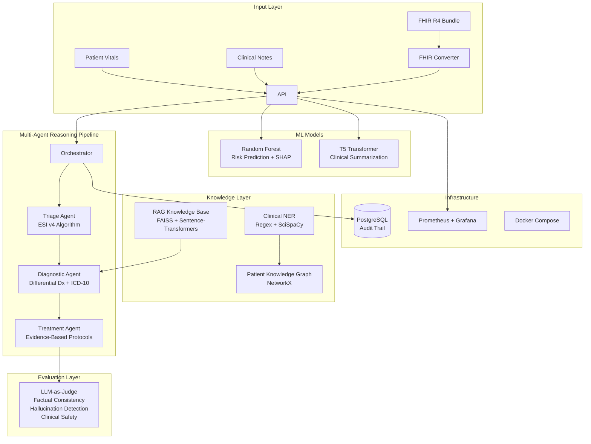

# HERA — Healthcare Reasoning & Analytics Platform

**Multi-agent clinical AI system with RAG knowledge retrieval, biomedical NER, FHIR R4 interoperability, and LLM-as-Judge evaluation.**

[](https://github.com/Nerdboss-stm/hera-healthcare-ai/actions)


---

## What This Is

HERA is a production-grade healthcare AI platform that goes beyond single-model inference. It implements a **multi-agent clinical reasoning pipeline** where specialized AI agents collaborate on patient cases — mimicking how real clinical teams operate (triage nurse → diagnostician → treatment planner). Every output is grounded in **retrieval-augmented medical knowledge**, validated by an **LLM-as-Judge evaluation framework**, and exchanged via **HL7 FHIR R4** — the healthcare interoperability standard.

### What Makes This Different

| Capability | What It Does | Why It Matters |
|---|---|---|
| **Multi-Agent Reasoning** | 3 specialized agents (Triage → Diagnostic → Treatment) with auditable reasoning chains | No single model handles the full clinical workflow — agents decompose the problem like real teams |
| **RAG Knowledge Base** | FAISS vector store over medical guidelines (AHA, IDSA, ESC) with citation tracking | Grounds AI outputs in evidence-based medicine, not just model weights |
| **Clinical NER + Knowledge Graph** | Regex + SciSpaCy entity extraction → NetworkX patient graph | Structures unstructured notes into queryable, traversable relationships |
| **FHIR R4 Interoperability** | Bidirectional FHIR Bundle ↔ internal format conversion | Industry-standard data exchange — shows you understand the healthcare domain |
| **LLM-as-Judge Evaluation** | Factual consistency, hallucination detection, clinical safety scoring | Goes beyond ROUGE — catches clinically dangerous errors that n-gram metrics miss |
| **CI/CD with Model Gates** | GitHub Actions: lint → test → model smoke test → Docker build | ML-specific CI — not just "does it compile" but "does the model still work" |

---

## Architecture


```mermaid
flowchart TB
    subgraph Input Layer
        A[Patient Vitals] --> API
        B[Clinical Notes] --> API
        C[FHIR R4 Bundle] --> FHIR[FHIR Converter]
        FHIR --> API
    end

    subgraph Multi-Agent Reasoning Pipeline
        API --> Orchestrator
        Orchestrator --> Triage[Triage Agent<br/>ESI v4 Algorithm]
        Triage --> Diagnostic[Diagnostic Agent<br/>Differential Dx + ICD-10]
        Diagnostic --> Treatment[Treatment Agent<br/>Evidence-Based Protocols]
    end

    subgraph Knowledge Layer
        RAG[RAG Knowledge Base<br/>FAISS + Sentence-Transformers] --> Diagnostic
        NER[Clinical NER<br/>Regex + SciSpaCy] --> KG[Patient Knowledge Graph<br/>NetworkX]
    end

    subgraph Evaluation Layer
        Treatment --> Evaluator[LLM-as-Judge<br/>Factual Consistency<br/>Hallucination Detection<br/>Clinical Safety]
    end

    subgraph ML Models
        RF[Random Forest<br/>Risk Prediction + SHAP]
        T5[T5 Transformer<br/>Clinical Summarization]
    end

    subgraph Infrastructure
        DB[(PostgreSQL<br/>Audit Trail)]
        Prom[Prometheus + Grafana]
        Docker[Docker Compose]
    end

    API --> RF
    API --> T5
    Orchestrator --> DB
    API --> Prom
```

---

## API Endpoints

| Endpoint | Method | Description |
|----------|--------|-------------|
| `/api/reason` | POST | Multi-agent clinical reasoning (Triage → Diagnosis → Treatment) |
| `/api/rag/query` | POST | Semantic search over medical knowledge base |
| `/api/rag/summarize` | POST | RAG-augmented clinical note summarization with citations |
| `/api/ner/extract` | POST | Extract medications, conditions, procedures, lab values from notes |
| `/api/ner/graph` | POST | Build patient knowledge graph from clinical note |
| `/api/fhir/predict` | POST | Accept FHIR R4 Bundle → return FHIR RiskAssessment |
| `/api/evaluate` | POST | Evaluate clinical AI output for factual consistency and safety |
| `/api/predict` | POST | Patient risk prediction from vitals |
| `/api/summarize` | POST | Clinical note summarization |
| `/api/health` | GET | Service health check (all 7 subsystems) |
| `/metrics` | GET | Prometheus metrics |

---

## Quick Start

```bash
# Clone and install
git clone https://github.com/Nerdboss-stm/hera-healthcare-ai.git
cd hera-healthcare-ai
pip install -r requirements.txt

# Run the API
uvicorn serving.api:app --host 0.0.0.0 --port 8000

# Or use Docker Compose (includes PostgreSQL, Prometheus, Grafana)
docker-compose up --build -d
```

### Try the Multi-Agent Pipeline

```bash
curl -X POST http://localhost:8000/api/reason \
  -H "Content-Type: application/json" \
  -d '{
    "patient_id": "pt-001",
    "chief_complaint": "chest pain",
    "clinical_note": "65yo male with acute chest pain radiating to left arm, diaphoresis, tachycardia. History of hypertension and diabetes. Currently on aspirin and metoprolol.",
    "heart_rate": 110,
    "respiratory_rate": 22,
    "body_temperature": 37.2,
    "oxygen_saturation": 93,
    "systolic_bp": 90,
    "diastolic_bp": 60,
    "age": 65,
    "gender": "male",
    "medical_history": ["hypertension", "diabetes"],
    "current_medications": ["aspirin", "metoprolol"],
    "allergies": ["penicillin"]
  }'
```

**Response includes:**
- ESI triage level with rationale
- Ranked differential diagnoses with ICD-10 codes
- Evidence-based treatment plan with contraindication checking
- Full reasoning audit trail
- Consensus confidence score

---

## Project Structure

```
hera-healthcare-ai/
├── agents/                       # Multi-Agent Clinical Reasoning
│   ├── protocols.py              # Typed inter-agent message contracts
│   ├── triage.py                 # ESI v4 triage algorithm
│   ├── diagnostic.py             # Differential diagnosis with ICD-10
│   ├── treatment.py              # Evidence-based treatment protocols
│   └── orchestrator.py           # Pipeline coordinator + audit trail
├── rag/                          # RAG Medical Knowledge Base
│   ├── knowledge_base.py         # Curated medical corpus (AHA/IDSA/ESC)
│   ├── retriever.py              # FAISS vector search + sentence-transformers
│   └── rag_pipeline.py           # Retrieve → augment → generate
├── ner/                          # Clinical NER + Knowledge Graph
│   ├── extractor.py              # Biomedical entity extraction (UMLS-linked)
│   └── knowledge_graph.py        # NetworkX patient graph with relationships
├── fhir_layer/                   # FHIR R4 Interoperability
│   └── converter.py              # Bidirectional FHIR ↔ internal conversion
├── evaluation/                   # LLM-as-Judge Framework
│   └── evaluator.py              # Factual consistency, hallucination, safety
├── risk_prediction/              # ML Risk Classification
│   ├── preprocessing.py          # Feature engineering (BMI, MAP)
│   ├── train.py                  # Random Forest training
│   ├── tune.py                   # GridSearchCV hyperparameter tuning
│   └── explain.py                # SHAP explainability
├── clinical_summarizer/          # T5 Clinical Summarization
│   ├── fine_tune.py              # End-to-end T5 fine-tuning
│   ├── evaluate.py               # ROUGE + BERTScore evaluation
│   └── generate_notes.py         # Synthetic clinical note generator
├── serving/                      # FastAPI Application
│   ├── api.py                    # 11 REST endpoints
│   ├── schemas.py                # Pydantic request/response models
│   ├── summarizer.py             # T5 inference wrapper
│   ├── risk_predictor.py         # Risk model inference
│   ├── db_logger.py              # PostgreSQL logging
│   └── metrics.py                # Prometheus counters/histograms
├── tests/                        # 49 tests across 4 test files
│   ├── test_agents.py            # 20 tests: triage, diagnostic, treatment, orchestrator
│   ├── test_ner.py               # 13 tests: NER extraction, knowledge graph
│   ├── test_fhir.py              # 8 tests: FHIR parsing, conversion
│   └── test_evaluation.py        # 8 tests: factual consistency, hallucination
├── database/schema.sql           # PostgreSQL schema (6 tables)
├── .github/workflows/ci.yml      # CI/CD: lint → test → model smoke → Docker
├── docker-compose.yml            # Full-stack orchestration
└── Dockerfile                    # API container
```

---

## Tech Stack

| Layer | Technology | Purpose |
|-------|-----------|---------|
| **Multi-Agent** | Custom Python agents | Clinical reasoning pipeline |
| **RAG** | FAISS + sentence-transformers | Evidence-grounded retrieval |
| **NER** | Regex + SciSpaCy (optional) | Biomedical entity extraction |
| **Knowledge Graph** | NetworkX | Patient relationship graph |
| **Interoperability** | HL7 FHIR R4 | Healthcare data exchange standard |
| **Risk Model** | scikit-learn (Random Forest) + SHAP | Interpretable risk classification |
| **Summarization** | HuggingFace T5 | Abstractive clinical summarization |
| **Evaluation** | Custom NLI-based evaluator | Factual consistency + safety scoring |
| **API** | FastAPI + Pydantic | REST endpoints with validation |
| **Database** | PostgreSQL | Audit trail + prediction logging |
| **Monitoring** | Prometheus + Grafana | Observability |
| **CI/CD** | GitHub Actions + ruff | Lint, test, model smoke test, Docker |
| **Container** | Docker + Docker Compose | Full-stack orchestration |

---

## Key Engineering Decisions

| Decision | Rationale |
|----------|-----------|
| **Multi-agent over monolithic LLM** | Clinical reasoning is inherently multi-step — triage, diagnosis, and treatment require different expertise. Agents provide separation of concerns, auditability, and independent testability. |
| **RAG over fine-tuning for medical knowledge** | Medical guidelines update frequently. RAG lets us swap knowledge without retraining. Citation tracking provides provenance that fine-tuning cannot. |
| **Rule-based NER + optional SciSpaCy** | Regex patterns give deterministic extraction for known entities. SciSpaCy augments with learned patterns. Dual approach ensures reliability without heavy dependencies. |
| **FHIR R4 for interoperability** | FHIR is the mandated standard for US healthcare data exchange (21st Century Cures Act). Building native FHIR support shows domain expertise. |
| **LLM-as-Judge over ROUGE alone** | ROUGE measures n-gram overlap but can't detect hallucinations or clinically dangerous errors. Entity-level precision/recall and safety checks catch what ROUGE misses. |
| **Random Forest + SHAP over deep learning for vitals** | Interpretability is non-negotiable in clinical risk scoring. SHAP provides feature-level explanations that clinicians can audit. |
| **PostgreSQL with JSONB** | Relational schema for structured data + JSONB for flexible audit trails. ACID guarantees matter for healthcare compliance. |
| **Synthetic clinical notes** | Avoids PHI/HIPAA concerns while maintaining realistic structure for model training. |

---

## Running Tests

```bash
# Run all 49 tests
pytest tests/ -v

# Run specific test suites
pytest tests/test_agents.py -v      # Multi-agent pipeline (20 tests)
pytest tests/test_ner.py -v         # NER + knowledge graph (13 tests)
pytest tests/test_fhir.py -v        # FHIR converter (8 tests)
pytest tests/test_evaluation.py -v  # Clinical evaluator (8 tests)

# Lint
ruff check .
ruff format --check .
```

---

## Monitoring

| Service | URL | Purpose |
|---------|-----|---------|
| FastAPI | `http://localhost:8000` | All 11 API endpoints |
| Prometheus | `http://localhost:9090` | Metrics collection |
| Grafana | `http://localhost:3000` | Visualization dashboards |
| PostgreSQL | `localhost:5432` | Prediction + audit storage |

---

## License

MIT
