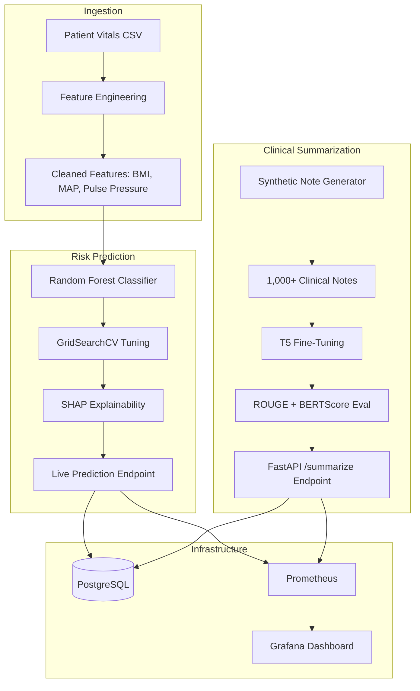

# HERA — Healthcare Risk Analytics Platform

**End-to-end ML platform for patient risk prediction and clinical note summarization.**


---

## What This Does

HERA is a full-stack healthcare AI system with two production pipelines. The **Risk Prediction Pipeline** ingests patient vitals, engineers clinical features, and classifies patients as High Risk or Low Risk using a tuned Random Forest model with SHAP explainability. The **Clinical Summarization Pipeline** fine-tunes a T5 transformer on 1,000+ synthetic clinical notes and serves abstractive summaries via a FastAPI endpoint. Both pipelines log predictions to PostgreSQL and expose Prometheus metrics for monitoring.

---

## Architecture


```mermaid
flowchart TB
    subgraph Ingestion
        A[Patient Vitals CSV] --> B[Feature Engineering]
        B --> C[Cleaned Features: BMI, MAP, Pulse Pressure]
    end

    subgraph Risk Prediction
        C --> D[Random Forest Classifier]
        D --> E[GridSearchCV Tuning]
        E --> F[SHAP Explainability]
        F --> G[Live Prediction Endpoint]
    end

    subgraph Clinical Summarization
        H[Synthetic Note Generator] --> I[1,000+ Clinical Notes]
        I --> J[T5 Fine-Tuning]
        J --> K[ROUGE + BERTScore Eval]
        K --> L[FastAPI /summarize Endpoint]
    end

    subgraph Infrastructure
        G --> M[(PostgreSQL)]
        L --> M
        G --> N[Prometheus]
        L --> N
        N --> O[Grafana Dashboard]
    end
```

---

## Key Engineering Decisions

| Decision | Rationale |
|----------|-----------|
| **Random Forest + SHAP** over deep learning for vitals | Interpretability is non-negotiable in clinical risk scoring — SHAP provides feature-level explanations that clinicians can audit. |
| **T5-small** for summarization | Encoder-decoder architecture handles abstractive summarization well; T5-small balances quality with fine-tuning cost on consumer hardware. |
| **PostgreSQL** over NoSQL | Patient predictions have a fixed relational schema; ACID guarantees matter for audit trails in healthcare. |
| **GridSearchCV** for hyperparameter tuning | Exhaustive search over a constrained parameter space ensures reproducibility across training runs. |
| **Prometheus + Grafana** for monitoring | Industry-standard observability stack; Prometheus pull-based scraping integrates cleanly with FastAPI's metrics endpoint. |
| **Synthetic clinical notes** | Avoids PHI/HIPAA concerns while maintaining realistic note structure for model training. |

---

## Quick Start

```bash
# Clone the repository
git clone https://github.com/nerdboss-stm/hera-healthcare-ai.git
cd hera-healthcare-ai

# Start all services (API, PostgreSQL, Prometheus, Grafana)
docker-compose up --build -d

# Verify services
curl http://localhost:8000/              # FastAPI health check
curl http://localhost:8000/metrics       # Prometheus metrics
open http://localhost:3000               # Grafana dashboard (admin/admin)
open http://localhost:9090               # Prometheus UI

# Test the summarization endpoint
curl -X POST http://localhost:8000/summarize \
  -H "Content-Type: application/json" \
  -d '{"note": "Patient is a 65-year-old male presenting with chest pain. Troponin elevated at 0.8 ng/mL. Started on anticoagulation therapy."}'
```

> **Note:** The T5 model weights are not included in this repository. To use the summarization endpoint, either download the fine-tuned model from [HuggingFace](https://huggingface.co/) or retrain locally:
> ```bash
> python -m clinical_summarizer.fine_tune
> ```

---

## Project Structure

```
hera-healthcare-ai/
├── risk_prediction/           # Subsystem 1: Vitals risk classification
│   ├── preprocessing.py       # Null handling, BMI/MAP/pulse pressure
│   ├── train.py               # Random Forest training
│   ├── tune.py                # GridSearchCV hyperparameter tuning
│   ├── explain.py             # SHAP explainability
│   ├── predict.py             # Live prediction → PostgreSQL
│   └── monitor.py             # Flask + Prometheus metrics server
├── clinical_summarizer/       # Subsystem 2: T5 note summarization
│   ├── generate_notes.py      # Synthetic clinical note generator
│   ├── dataset.py             # T5 preprocessing (summarize: prefix)
│   ├── model.py               # T5 model/tokenizer loader
│   ├── trainer.py             # HuggingFace Trainer + ROUGE metrics
│   ├── fine_tune.py           # End-to-end fine-tuning orchestrator
│   ├── evaluate.py            # ROUGE + BERTScore evaluation
│   └── configs/               # Training configurations
├── serving/                   # API layer
│   ├── api.py                 # FastAPI app (/summarize, /metrics)
│   ├── schemas.py             # Pydantic request/response models
│   ├── summarizer.py          # T5 inference wrapper
│   ├── db_logger.py           # PostgreSQL logging
│   └── metrics.py             # Prometheus counters/histograms
├── data/
│   ├── raw/                   # Original vitals dataset
│   ├── processed/             # Cleaned + feature-engineered data
│   └── clinical_notes/        # Generated clinical notes
├── config/                    # Prometheus, alerts, app settings
├── database/                  # PostgreSQL schema
├── tests/                     # pytest test suite
├── docs/                      # Model card, evaluation report
├── docker-compose.yml         # Full-stack orchestration
└── Dockerfile                 # API container
```

---

## Risk Prediction Pipeline

1. **Ingest** raw patient vitals (heart rate, respiratory rate, SpO2, blood pressure, temperature)
2. **Clean** nulls via mean imputation; engineer BMI, MAP, and pulse pressure features
3. **Train** a Random Forest classifier on the labeled dataset
4. **Tune** hyperparameters via 5-fold cross-validated GridSearchCV
5. **Explain** predictions with SHAP beeswarm plots for feature importance
6. **Predict** on new patients in real-time, logging results to PostgreSQL
7. **Monitor** prediction counts and risk distribution via Prometheus gauges

---

## Clinical Summarization Pipeline

1. **Generate** 1,000+ synthetic clinical notes with realistic structure (chief complaint, HPI, ROS, physical exam, labs, imaging, assessment, plan)
2. **Preprocess** notes with the `summarize:` prefix required by T5
3. **Fine-tune** T5-small using HuggingFace's `Seq2SeqTrainingArguments`
4. **Evaluate** with ROUGE-1/2/L and BERTScore F1
5. **Serve** via FastAPI with Pydantic validation and structured JSON responses
6. **Log** every summarization request and result to PostgreSQL

---

## Monitoring

| Service | URL | Purpose |
|---------|-----|---------|
| FastAPI | `http://localhost:8000` | Summarization API |
| Prometheus | `http://localhost:9090` | Metrics collection |
| Grafana | `http://localhost:3000` | Visualization dashboards |
| PostgreSQL | `localhost:5432` | Prediction + summary storage |

Prometheus scrapes the `/metrics` endpoint every 5 seconds. Alerting rules fire when high-risk prediction counts exceed thresholds.

---

## Tech Stack

| Component | Technology | Purpose |
|-----------|-----------|---------|
| Risk Model | scikit-learn (Random Forest) | Binary classification |
| Hyperparameter Tuning | GridSearchCV | Exhaustive parameter search |
| Explainability | SHAP | Feature importance visualization |
| Summarization Model | HuggingFace Transformers (T5) | Abstractive text summarization |
| Training Framework | PyTorch + HuggingFace Trainer | Model fine-tuning |
| Evaluation | ROUGE, BERTScore | Summarization quality metrics |
| API Framework | FastAPI | REST endpoint serving |
| Monitoring API | Flask + prometheus_client | Risk prediction metrics |
| Database | PostgreSQL | Prediction and summary logging |
| Monitoring | Prometheus + Grafana | Observability |
| Containerization | Docker + Docker Compose | Service orchestration |

---

## Status

Core pipeline operational. Both subsystems trained, evaluated, and serving predictions via API with full observability.
